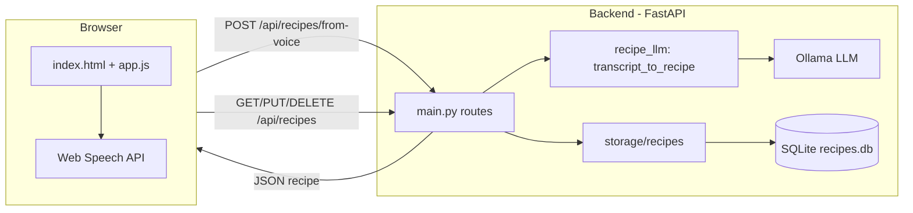

# Recipe AI

A personal recipe website that turns spoken or typed recipe descriptions into structured recipes (title, ingredients, steps, tags) using a local LLM, and stores them for browsing and editing.

## What it does

- **Create recipes from voice**: Use the browser’s speech recognition to speak a recipe; the app turns the transcript into a structured recipe (title, ingredients, steps, tags) via an LLM and saves it.
- **Create recipes from text**: Paste or type a recipe description and create a structured recipe the same way.
- **Manage recipes**: List all recipes, open the latest created one, and edit or delete any recipe.

Recipes are stored in a local SQLite database. The LLM runs locally via [Ollama](https://ollama.ai/) (default model: `llama3.2`).

---

## Tools and why they’re used

| Tool | Purpose |
|------|--------|
| **FastAPI** | API and web server: REST endpoints for recipes, static file serving, and serving the single-page app. |
| **Uvicorn** | ASGI server to run the FastAPI app with async support. |
| **LangChain (langchain-ollama, langchain-core)** | Wires the app to Ollama (`ChatOllama`), builds the prompt with `ChatPromptTemplate`, and invokes the LLM to get JSON. Keeps prompt and model in one place and handles response parsing. |
| **Ollama** | Local LLM runtime so recipe extraction runs on your machine without external APIs. |
| **Pydantic** | Request/response and domain models (`Recipe`, `RecipeCreate`, `VoiceBody`) and validation. |
| **python-dotenv** | Loads `.env` for `OLLAMA_BASE_URL` and `OLLAMA_MODEL` without hardcoding. |
| **SQLite** | Simple, file-based storage for recipes; no separate database server. |
| **Web Speech API (browser)** | Captures microphone input and produces the transcript sent to the backend for recipe creation. |

---

## Folder structure

```
recipe-ai/
├── app/
│   ├── __init__.py
│   ├── main.py              # FastAPI app, routes, static mount, lifespan
│   ├── models/
│   │   ├── __init__.py
│   │   └── recipe.py         # Pydantic models: RecipeCreate, Recipe
│   ├── services/
│   │   ├── __init__.py
│   │   └── recipe_llm.py     # LLM integration: transcript → RecipeCreate (Ollama + LangChain)
│   └── storage/
│       ├── __init__.py       # Re-exports from recipes
│       └── recipes.py        # SQLite CRUD: init_db, list/add/get/update/delete_recipe
├── static/
│   ├── index.html            # Single-page UI: tabs (Create Recipe, My Recipes), voice controls, edit modal
│   ├── app.js                # Speech recognition, API calls, DOM updates, edit/delete
│   └── styles.css            # Layout and styling
├── data/                     # Created at runtime; holds recipes.db (SQLite)
├── requirements.txt
├── .env                      # Optional: OLLAMA_BASE_URL, OLLAMA_MODEL
└── README.md
```

- **`app/main.py`** – Defines the FastAPI app, lifespan (DB init), routes (`/health`, `/api/recipes/*`, `/api/recipes/from-voice`), and serves `static/` and the root as `index.html`.
- **`app/models/recipe.py`** – Data shapes: `RecipeCreate` for input/LLM output, `Recipe` for stored records (adds `id`, `created_at`).
- **`app/services/recipe_llm.py`** – Builds the Ollama client and prompt, calls the LLM, parses JSON (including markdown-wrapped), and returns a `RecipeCreate` instance.
- **`app/storage/recipes.py`** – All persistence: creates `data/` and `recipes.db`, runs migrations (table/index), and implements list, add, get, update, delete.
- **`static/`** – Frontend: one HTML page, one JS bundle (voice, fetch, render, edit/delete), one CSS file.

---

## High-level architecture



**Flow for creating a recipe from voice or text**

1. User speaks (or types) a recipe; the frontend sends the **transcript** to `POST /api/recipes/from-voice`.
2. **main.py** validates the body, then calls `transcript_to_recipe(transcript)` in a thread so the async server doesn’t block.
3. **recipe_llm** sends the transcript to **Ollama** with a fixed prompt asking for JSON (title, ingredients, steps, tags); it parses the response (including ```json blocks) into a `RecipeCreate` object.
4. **main.py** calls `add_recipe(recipe_create)`; **storage** generates an id and `created_at`, inserts into SQLite, and returns a `Recipe`.
5. The API returns that `Recipe` as JSON; the frontend shows it under “Latest recipe” and prepends it to the list; “My Recipes” loads the list via `GET /api/recipes` (same storage layer).

**Flow for list / edit / delete**

- List: `GET /api/recipes` → `list_recipes()` → JSON array of `Recipe`.
- Edit: `PUT /api/recipes/{id}` with `RecipeCreate` body → `update_recipe()` → JSON `Recipe`.
- Delete: `DELETE /api/recipes/{id}` → `delete_recipe()` → 204-style success.

---

## Run the project

1. Install and run [Ollama](https://ollama.ai/), and pull a model (e.g. `ollama pull llama3.2`).
2. From the project root:
   ```bash
   python -m venv .venv
   source .venv/bin/activate   # or .venv\Scripts\activate on Windows
   pip install -r requirements.txt
   uvicorn app.main:app --reload
   ```
3. Open http://127.0.0.1:8000 and use “Create Recipe” (voice or text) and “My Recipes” (list, edit, delete).

Optional: create a `.env` with `OLLAMA_BASE_URL` and/or `OLLAMA_MODEL` if you use a different Ollama URL or model.
